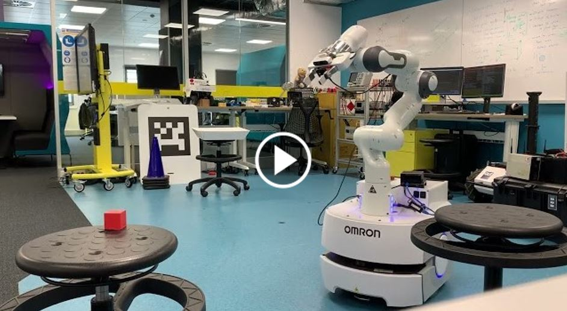
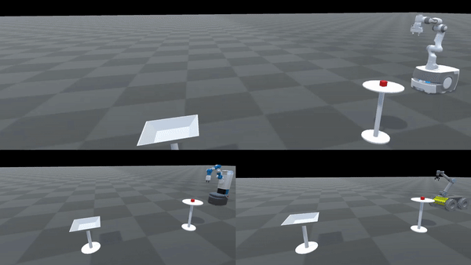
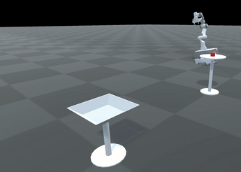

# Manipulation *On-The-Move*
Why do mobile robots come to a stop when they grasp something or put something down? Humans are quite capable of performing such manipulation tasks while walking or even running. By performing tasks *on-the-move* overall execution time for multi-step tasks can be significantly reduced, and the resulting motion is more natural and graceful.

This project develops an architecture for allowing mobile manipulators to perform reactive manipulation tasks on-the-move. Reactive control allows for robust performance in complex, dynamic environments, such as grasping moving objects.

## Pick-and-Place Tasks
This video demonstrates performance of the architecture on a real-world mobile manipulator performing a pick-and-place task.

Compare this behaviour to a reactive baseline implementation which treats the grasping and placing as two separate tasks. 

## Grasping Moving Objects
Closed-loop feedback from a camera in the palm and the reactive controller enables grasping of objects with unpredictable motion. 

## Complex, Multi-step Tasks
The generalised architecture allows for chaining of multiple actions and the execution of complex, multi-step tasks.

## Even Faster Grasping
Even faster grasping can be achieved by allowing a relative velocity between gripper and object at the time of grasping. However, typical antipodal grippers close relatively slowly. This means that they must start closing long before they are near the object in order to succesfully grasp while moving past an object at speed. For reliable operation the timing for the start of gripper closing must be extremely precise. This method also imparts a large acceleration on the object as it is picked up, which may cause damage. 

## Simulation Environment
To assist in devlopment we built a simulation and visulalisation environment in Unity. This simulation provides the same ROS interfaces as the real robot, allowing seamless testing. The environment also allows us to test our architecture on various robot platforms. 

The simulation can also be used to investigate how the reactive architecture can be used to compensate for base disturbances. In the case shown below, the controller has no prior knowledge of the rolling base motion, but reacts to observations in order to stabilise the gripper in world space. 

Paper coming soon!
