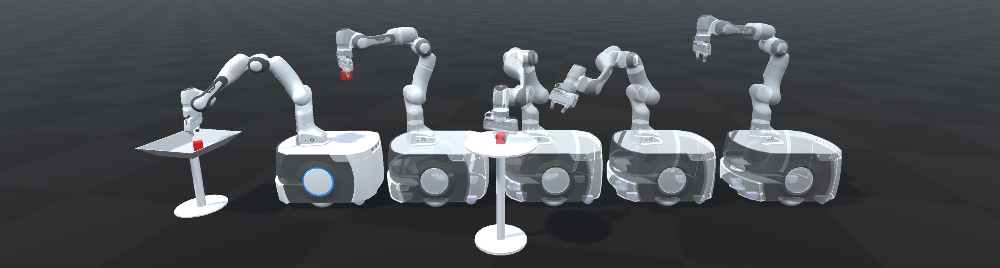

# Manipulation *On-The-Move*
Why do mobile robots come to a stop when they grasp something or put something down? Humans are quite capable of performing such manipulation tasks while walking or even running. By performing tasks *on-the-move* overall execution time for multi-step tasks can be significantly reduced, and the resulting motion is more natural and graceful.

This project develops an architecture for allowing mobile manipulators to perform reactive manipulation tasks on-the-move. Reactive control allows for robust performance in complex, dynamic environments, such as grasping moving objects.

[Paper available here](https://arxiv.org/abs/2212.06991)

[Project video here](https://youtu.be/C39rBTytiWc)

[Related work on holistic mobile manipulation]
(https://jhavl.github.io/holistic/)

[Robotics Toolbox for Python]
(https://github.com/petercorke/robotics-toolbox-python)

<video src="https://user-images.githubusercontent.com/32886576/236379737-70c3feb8-5729-425a-a825-601b2f6f6583.mp4" data-canonical-src="https://user-images.githubusercontent.com/32886576/236379737-70c3feb8-5729-425a-a825-601b2f6f6583.mp4" controls="controls" muted="muted" class="d-block rounded-bottom-2 border-top width-fit" style="max-height:640px; min-height: 200px"></video>

## Pick-and-Place Tasks
This video demonstrates performance of the architecture on a real-world mobile manipulator performing a pick-and-place task.

Compare this behaviour to a reactive baseline implementation which treats the grasping and placing as two separate tasks. 

## Grasping Moving Objects
Closed-loop feedback from a camera in the palm and the reactive controller enables grasping of objects with unpredictable motion. 

## Complex, Multi-step Tasks
The generalised architecture allows for chaining of multiple actions and the execution of complex, multi-step tasks.

## Even Faster Grasping
Even faster grasping can be achieved by allowing a relative velocity between gripper and object at the time of grasping. However, typical antipodal grippers close relatively slowly. This means that they must start closing long before they are near the object in order to succesfully grasp while moving past an object at speed. For reliable operation the timing for the start of gripper closing must be extremely precise. This method also imparts a large acceleration on the object as it is picked up, which may cause damage. 

## Manipulation On-The-Move with Obstacles
We are currently working towards extending our reactive architecture to performing manipulation on the move in environments with static and dynamic obstacles. The gif below shows some early results. The system is capable of avoiding static and dynamic obstacles while performing pick-and-place tasks on-the-move. 

This video shows the same clip in realtime and synchronised with a visualisation of the robots understanding of the environment as mapped by the 2D lidar attached to the base. 

Here we demonstrate our system performing a manipulation on-the-move task while sharing the space with, and avoiding, a second autonomous robot:

We also present a simulated experiment with 4 obstacle robots which results in more frequent interactions and avoidance manoeuvres. 

## Manipulation On-The-Move for Complex Tasks

We are also working on adding the capability to perform more complex tasks beyond pick-and-place. For example, in the simulated video below the robot must also open and close a set of drawers. In the future, we would like to implement other manipulation primitives that can be done on-the-move such as opening/closing doors, pressing buttons, turning valves, and more. 

## Enabling Failure Recovery for Manipulation On-The-Move
Performing manipulation tasks on-the-move introduces a new challenge for graceful recovery in the event of inevitable failures. For example, if the robot fails to grasp an object while driving past, the object may no longer be within range by the time a second attempt is made. We have developed a base control method that keeps the robot near the object while performing grasps, while also making as much progress as possible toward the next goal in a task, performing grasps on-the-move where possible. [More details are available here.](https://benburgesslimerick.github.io/MotM-FailureRecovery/)

This video shows a comparison with two baseline methods. 

## Simulation Environment
To assist in devlopment we built a simulation and visulalisation environment in Unity. This simulation provides the same ROS interfaces as the real robot, allowing seamless testing. The environment also allows us to test our architecture on various robot platforms. 

The simulation can also be used to investigate how the reactive architecture can be used to compensate for base disturbances. In the case shown below, the controller has no prior knowledge of the rolling base motion, but reacts to observations in order to stabilise the gripper in world space. 

Paper coming soon!
